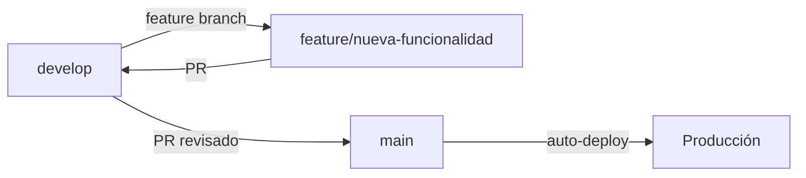

# 🤝 Guía de Contribución - DevTrack

## 📋 Flujo de Trabajo con Git

### Ramas Principales

- **`main`** - Producción (desplegado en Render + Vercel)
- **`develop`** - Desarrollo (integración de features)

### Ramas de Trabajo

Para nuevas features o fixes:

```bash
# 1. Actualizar develop
git checkout develop
git pull origin develop

# 2. Crear rama de feature
git checkout -b feature/nombre-descriptivo
# o para bugs
git checkout -b fix/nombre-del-bug

# 3. Hacer commits descriptivos
git add .
git commit -m "feat: descripción del cambio"

# 4. Push a GitHub
git push -u origin feature/nombre-descriptivo

# 5. Crear Pull Request a develop en GitHub
```

---

## 📝 Convenciones de Commits

Usamos [Conventional Commits](https://www.conventionalcommits.org/):

```
tipo(scope): descripción corta

[cuerpo opcional]
[footer opcional]
```

### Tipos de Commit

- `feat`: Nueva funcionalidad
- `fix`: Corrección de bug
- `docs`: Cambios en documentación
- `style`: Cambios de formato (no afectan funcionalidad)
- `refactor`: Refactorización de código
- `test`: Agregar o modificar tests
- `chore`: Tareas de mantenimiento

### Ejemplos

```bash
feat(courses): agregar filtro por estado en ejercicios
fix(auth): corregir validación de email en registro
docs(readme): actualizar instrucciones de instalación
test(accounts): agregar tests para verificación de email
```

---

## 🧪 Testing

### Backend

```bash
cd backend

# Ejecutar todos los tests
pytest --cov

# Tests de una app específica
pytest courses/tests/ -v

# Con cobertura HTML
pytest --cov --cov-report=html
```

### Frontend

```bash
cd frontend

# Ejecutar tests
npm test

# Con cobertura
npm run test:coverage

# Modo watch
npm test -- --watch
```

---

## 🚀 Antes de Hacer Pull Request

### Checklist

- [ ] ✅ Tests pasan (`pytest` y `npm test`)
- [ ] 📝 Código documentado (docstrings, comentarios)
- [ ] 🎨 Código formateado correctamente
- [ ] 🔍 Sin `console.log()` o `print()` de debug
- [ ] 📚 Documentación actualizada si aplica
- [ ] ✨ Commit messages siguen convenciones

### Comandos Pre-Commit

```bash
# Backend
cd backend
pytest --cov
python manage.py check

# Frontend
cd frontend
npm test
npm run build  # Verificar que compile
```

---

## 🔄 Workflow Completo



### 1. Trabajar en Feature

```bash
git checkout develop
git pull origin develop
git checkout -b feature/mi-feature

# Desarrollar...
git add .
git commit -m "feat: mi nueva funcionalidad"
git push -u origin feature/mi-feature
```

### 2. Crear Pull Request

1. Ve a GitHub → **Pull Requests** → **New**
2. Base: `develop` ← Compare: `feature/mi-feature`
3. Describe los cambios
4. Asigna reviewers si aplica
5. **Create Pull Request**

### 3. Después del Merge

```bash
# Limpiar rama local
git checkout develop
git pull origin develop
git branch -d feature/mi-feature

# Limpiar rama remota (opcional)
git push origin --delete feature/mi-feature
```

---

## 📦 Release a Producción

Cuando `develop` está listo para producción:

```bash
# 1. Crear PR de develop → main en GitHub
# 2. Revisar todos los cambios
# 3. Hacer merge
# 4. Render y Vercel auto-desplegarán
```

---

## 🛠️ Setup Local

### Primera vez

```bash
# Clonar repo
git clone https://github.com/HeberYesid/DevTrack.git
cd DevTrack

# Cambiar a develop
git checkout develop

# Backend
cd backend
python -m venv .venv
.venv\Scripts\Activate.ps1  # Windows
pip install -r requirements.txt
python manage.py migrate

# Frontend
cd ../frontend
npm install
```

### Cada vez que trabajas

```bash
# Actualizar develop
git checkout develop
git pull origin develop

# Crear feature branch
git checkout -b feature/mi-trabajo
```

---

## 🆘 Solución de Problemas

### Conflictos de Merge

```bash
# Si hay conflictos al hacer pull
git checkout develop
git pull origin develop

# Resolver conflictos en los archivos
# Luego:
git add .
git commit -m "resolve: conflictos en merge"
```

### Deshacer Cambios

```bash
# Descartar cambios no commiteados
git restore <archivo>

# Deshacer último commit (mantener cambios)
git reset --soft HEAD~1

# Deshacer último commit (descartar cambios)
git reset --hard HEAD~1
```

---

## 📞 Contacto

Si tienes dudas sobre el proceso de contribución, abre un **Issue** en GitHub.

---

**¡Gracias por contribuir a DevTrack! 🚀**
